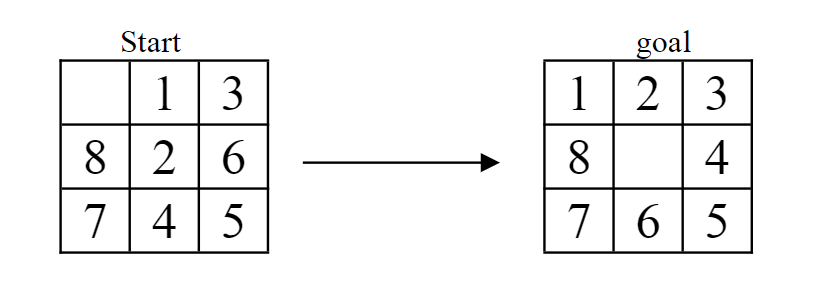

# A* Search

### Problem Statement

The new 8-puzzle has 8 tiles as usual, but each tile may move Up, Up-Right, Right, Down-Right, Down, Down-Left, Left and Up-Left. The cost of a regular move (Up, Down, Left, or Right) is 1, and the cost of a diagonal move (Up-Right, Down-Right, Down-Left, and Up-Left) is 1.4 (approximately =1.414).

Please use the A * search method to find a solution, and show the generated search tree with marked expansion order numbers and costs along with detailed major steps and relevant explanations clearly.


---
### High-Level Overview

The objective of the A* search algorithm is to find a path from an initial state to a goal state that minimizes the cost function $f(s)$, where 

$$
f(s) = g(s) + h(s)
$$

Where:
- $g(s)$: Cost to reach $s_{n+1}$ from $s_{n}$.
- $h(s)$: Estimated cost to reach $s_{\text{goal}}$ from $s_{n}$.

Given an initial state $s_0 \in \mathbb{R}^{3\times3}$, the problem can be defined recursively by the following algorithm:

$$
s_{n+1} = \arg\min f(s'_n) = \arg\min [h(s'_n) + g(s'_n)]
$$

Where:
- $s'_n \in S(s_n)$
- $S(s_n)$ is the search space of $s_n$ and contains all the possible next states of $s_n$ as determined by the position of the empty tile.

---
### Pseudocode

Assumption: No swapping elements that are already in the correct position.

**node BoardState:**
- *Attributes:* 
  - int[][] board
  - list<{i, j}> wrong
  - g-value
  - h-value
  - BoardState child

**function aStarSearch(currentBoardState):**
1. *If (currentBoardState = goalState) return*
2. *searchSpace = new list of candidates for nextBoardState*
    - *for every element in the wrong position:*
        - *generate a new duplicate board*
        - *swap the element and the empty tile*
        - *add the new board to searchSpace*
3. *nextBoardState = board from searchSpace with the minimum f-value*
4. *currentBoardState.child = nextBoardState*
5. *AStarSearch(nextBoardState)*


```
OUTPUT:

TRACE RESULTS=========================================
BoardState------------------
[0, 1, 3]
[8, 2, 6]
[7, 4, 5]
Misplaced Values-------------
[0, 0][0, 1][1, 1][1, 2][2, 1]
gValue=0.0, hValue=4.8284273, fValue=4.8284273
BoardState------------------
[1, 0, 3]
[8, 2, 6]
[7, 4, 5]
Misplaced Values-------------
[0, 1][1, 1][1, 2][2, 1]
gValue=1.0, hValue=3.8284273, fValue=4.8284273
BoardState------------------
[1, 2, 3]
[8, 0, 6]
[7, 4, 5]
Misplaced Values-------------
[1, 1][1, 2][2, 1]
gValue=1.0, hValue=2.828427, fValue=3.828427
BoardState------------------
[1, 2, 3]
[8, 6, 0]
[7, 4, 5]
Misplaced Values-------------
[1, 2][1, 1][2, 1]
gValue=1.0, hValue=2.4142137, fValue=3.4142137
BoardState------------------
[1, 2, 3]
[8, 6, 4]
[7, 0, 5]
Misplaced Values-------------
[2, 1][1, 1]
gValue=1.4142135, hValue=1.0, fValue=2.4142137
BoardState------------------
[1, 2, 3]
[8, 0, 4]
[7, 6, 5]
Misplaced Values-------------
[1, 1]
gValue=1.0, hValue=0.0, fValue=1.0
```

[](https://mermaid.live/edit#pako:eNqtll1v2jAUhv_KkaVKNAIWO86ntN2sq9SLdZPaqy0TdcEp1oJT5WNth_jvsx1CgNAUdeQCcpzznpzzvI6SJZpmM44ilKTZ03TO8hJuL2IZy7MzuOCJkByupCgFS-GmZCWPpf0zRncAEwCwLGxZ6t-JJZgjMItELVqWZ1nNsm-Wqcl172L0K5ZClqbqpNBVVck6dz6wz-Ej0HFQxw91bNdR0l7VNUyTX54fmSxEJgHDqP9YK675E3zPikLcpxyu1fTFBzNaAUmeLcA0NFJ3xPWg2IwwMb_vGJToKk3qAVwNyf4qpvHPLJ1WqeoOktEfllbaDDXzfIA1FadlZmLcMMMboorBJ71eq8geaRPjMW10JvbGZK0jHeDklMBVW842cNIFfhwq2lYxqYdt07XewRsbco4mQ1pyzg5vZ-OG4eY0Klrzpo2K7vE2sbvR0Q5v55S8VVvuG7wbfJMeUN6bNeihh6S2shc2DG4Fh_ucs988B1HA5dXlt3O1S7YtoL0W0DVKt1HRPRXdUdFdldcxgJ7SANWUf6QBtItuAy84yUPzigVqj7S08S7rduO2Xhhu_o7qWI-CDm33f2nHMjwKTgewtw34FTSKjd9OaffMiNcThmiIFjxfMDFT79ulzolROecLHqNInc54wqq01K_ClUplVZndvMgpisq84kNUPc7U_S8Ee8jZollUrFC0RM8octxw7AWhE4bYpr4buHSIXlDkjx2PhCEhNCCB7XvYXQ3R3yxTFfAQ8Zkos_xr_QVgPgRMyR_mur7D6h-V-PhO)
